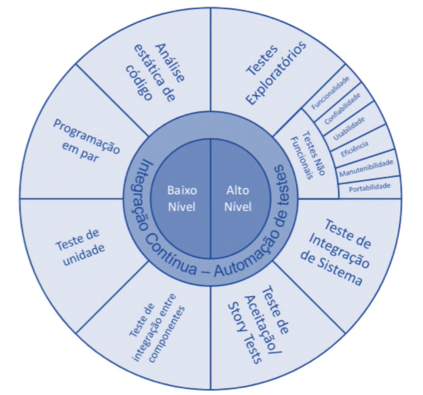
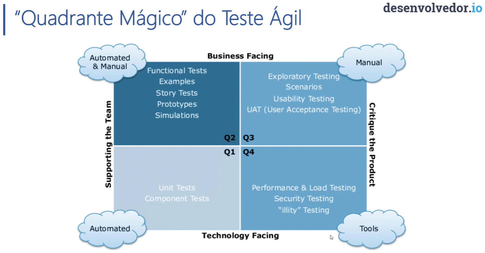

# **Anotações:**

---

## *A importância de testar*

---

## Por que testar?

Para garantir qualidade.

---

## Como testar?

Testes de Caixa-Preta e Caixa-Branca

### **Caixa-Preta**

- Testers execute functional and regression tests via user interface
  - E.g. functional tests, regression tests, UI tests

### **Caixa-Branca**

- Testers (or developers) look directly at code to find bugs and erros
  - E.g. unit tests, load tests

### **Baixo Nível / Alto Nível**



### **Quadrante Mágico do Teste Agil**



### **Consequências de não testar**

- Muitos bugs e problemas de qualidade
- Falhas de codificação
- Possíveis atrasos na entrega
- Perda de confiança do cliente
- Desmotivação do time
- Aumento na rotatividade de pessoas
- Prejuízos financeiros
- Possíveis implicações legais

---

## Regra 10 de Myers

"O Custo da correção de defeitos é mais custoso quanto mais tarde o defeito é encontrado."

---

## Mitos sobre os testes de software

"Eu não tenho tempo de testar!"  
"Testar é escrever o dobro de código!"  
"Se fizer o código certinho não precisa testar"  
"Testar é papel do testador"  
"Que adianta eu testar se o resto da equipe não testa?"  
"Os testes garantem 100% de software livre de erros"  
"Se passou no teste é porque não tem bug"  
"Eu já terminei. Só falta testar"  
"Testes de unidade só funcionam se for com TDD"  
"Testar manualmente é mais produtivo"  
"Não consigo convencer meu gerente!"

---

## Tipos de testes mais comuns

### **Testes de Unidade**

Um teste de unidade é aquele que testa uma única unidade do sistema. Realiza o teste de maneira isolada, geralmente simulando as prováveis dependências que aquela unidade tem.

Em linguagens orientadas a objetos, é comum que a unidade seja uma classe.  
Quando precisamos escrever testes de unidade para a classe ex Pedido, essa bateria de testes testará o funionamento da classe Pedido, isolada, sem interações com outras classes.

### **Testes de Integração**

Um teste de integração é aquele que testa a integração entre duas ou mais partes da sua aplicação.

Testes que você escreve para a sua classe PedidoService e PedidoRepository, por exemplo, onde seu teste vai até o banco de dados, é um teste de integração.

De fato você está testando a integração da sua aplicaçãop com suas diversas partes, por exemplo o banco de dados, uma camada de serviços externo.

Estes testes garantem algo que os testes de unidade não garantem, eles garantem que as unidades da sua aplicação estão se integrando conforme o esperado.

### **Testes Automatizados**

O teste automatizado é um teste de sistema, podemos considerar como um teste de aceitação, funciona como um teste de caixa preta, já que os sistema é testado de ponta a ponta através das oprações executadas no sistema.

A automatização garante que todo o processo será executado da mesma maneira que fosse um usuário utilizando a aplicação.

Pode ser considerado um teste de aceitação, pois neste teste além de garantir o funcionamento ponta a ponta, podemos validar características do negócio e funcionalidades.

### **Testes de carga**

O teste de carga (load test) consiste em testar as capacidades da aplicação, muitas vezes até seu limite, de forma que a aplicação não consiga mais responder. Pode ser também considerado como um teste de stress.

Existem alguns objetivos por trás do teste de carga:

- Testar a performance do código e componente em situações extremas. Descobrir possíveis gargalos.
- Testar como a aplicação irá se comportar com um determinado número de usuários simultâneos e garantir que irá atender a demanada.
- Testar um possível balanceamento de carga no servidor ou até mesmo a escala elástica na nuvem.

O teste de carga é muito importante em aplicações Web e em aplicações que é esperado um grande volume de requisições

---

## *Testes de Unidade*

---

## Objetivos

- Frameworks
- Nomenclaturas
- Ferramentas
- Escritas de testes
- Features do framework de teste
- Execução no VS, VSCode, Command Line
- Mock
- AutoMock
- Fixture
- Geração de dados
- Fluent Assertions

---

## Frameworks de Testes

### **MSTest**

É da própria Microsoft  

### Links

[docs.microsoft.com](https://docs.microsoft.com/en-us/dotnet/api/microsoft.visualstudio.testtools.unittesting?view=mstest-net-1.3.2)  
[GitHub](https://github.com/microsoft/testfx)

### **NUnit**

Framework muito consagrado.  
É uma portabilidade do JUnit (Java)  

#### Links

[NUnit.org](https://nunit.org/)  
[GitHub](https://github.com/nunit)

### **XUnit**

- Escrito pelos criadores do NUnit
- Compatível com Visual Studio
- Utilizado pelo time de desenvolvimento do .NET Core e ASP.NET
  - [Exemplo de uso pela própria Microsoft](https://github.com/dotnet/aspnetcore/blob/7a26d27e8b7f67a1ac80532e5872bfde6c28f952/src/Mvc/Mvc.Core/test/Filters/FilterProviderTest.cs)

#### Instalação do framework

```powershell
Install-Package xunit
```

#### Instalação para reconhecimento do Visual Studio

```powershell
Install-Package xunit.runner.visualstudio
```

#### Links

[xUnit.net](https://xunit.net/)  
[GitHub](https://github.com/xunit/xunit)  

#### *Obs.:*

*vamos utilizar o **XUnit***

---

## Padrões e Nomenclaturas

### **AAA - Arrange, Act, Assert**

Organizar os testes:

```csharp
[Fact]
public async Task MiddlewareFilter_SetsMiddlewareFilterFeature_OnExecution()
{
    // Arrange
    Task requestDelegate(HttpContext context) => Task.FromResult(true);
    var middlewareFilter = new MiddlewareFilter(requestDelegate);
    var httpContext = new DefaultHttpContext();
    var resourceExecutingContext = GetResourceExecutingContext(httpContext);
    var resourceExecutionDelegate = GetResourceExecutionDelegate(httpContext);

    // Act
    await middlewareFilter.OnResourceExecutionAsync(resourceExecutingContext, resourceExecutionDelegate);

    // Assert
    var feature = resourceExecutingContext.HttpContext.Features.Get<IMiddlewareFilterFeature>();
    Assert.NotNull(feature);
    Assert.Same(resourceExecutingContext, feature.ResourceExecutingContext);
    Assert.Same(resourceExecutionDelegate, feature.ResourceExecutionDelegate);
}
```

### **Nomenclatura de Testes de Unidade**

#### *Exemplos de nomenclaturas*

```ObjetoEmTeste_MetodoComportamentoEmTeste_ComportamentoEsperado```:

- ```Pedido_AdicionarPedidoItem_DeveIncrementarUnidadesSeItemJaExiste```
- ```Estoque_RetirarItem_DeveEnviarEmailSeAbaixoDe10Unidades```

```MetodoEmTeste_EstadoEmTeste_ComportamentoEsperado```:

- ```AdicionarPedidoItem_ItemExisteCarrinho_DeveIncrementarUnidadeDoItem```
- ```RetirarItemEstoque_EstoqueAbaixoDe10Unidades_DeveEnviarEmailDeAviso```

Obs.: Pode "usar vários padrões"/"misturar padrões" que melhor se adquem a cada teste, desde que não use muitos padrões diferentes ou fuja dos padrões.

#### Exemplos Vida Real

- [AspNetCore - FiletrProviderTest.cs](https://github.com/dotnet/aspnetcore/blob/7a26d27e8b7f67a1ac80532e5872bfde6c28f952/src/Mvc/Mvc.Core/test/Filters/FilterProviderTest.cs) <!-- ObjetoEmTeste_MetodoComportamentoEmTeste_ComportamentoEsperado -->
- [AspNetCore - ResponseCacheFilterExecutorTest.cs](https://github.com/dotnet/aspnetcore/blob/7a26d27e8b7f67a1ac80532e5872bfde6c28f952/src/Mvc/Mvc.Core/test/Filters/ResponseCacheFilterExecutorTest.cs) <!-- Estado Comportamento Invertido. (Mesmo padrão mas invertido) -->
- [AspNetCore - RequestSizeLimitFilterTest.cs](https://github.com/dotnet/aspnetcore/blob/7a26d27e8b7f67a1ac80532e5872bfde6c28f952/src/Mvc/Mvc.Core/test/Filters/RequestSizeLimitFilterTest.cs) <!-- Não foi utilizada nenhuma das nomenclaturas, mas está claro a escrita dos testes (porém teriasido melhor fazer de forma mais expressiva)  -->

---

## A importância do Mock

### O que é um Mock?

Objetos Mock, objetos simulados ou simplemente Mock (do inglês Mock object) são objetos que simulam o comportamento de objetos de forma controlada.

São normalmente criados para testar o comportamento de outros objesto. Em outras palavras, os objetos mock são objetos "falsos" que simulam o comportamento de uma classe ou objeto "real" para que possamos focar o teste na unidade a ser testada.

Uma vantagem do Mock é que o objeto simulado pode ser criado dinamicamente através de um framework de Mock e poupando o desenvolvedor ter que criar uma classe física para simular aquele objeto.

Uma classe física que simula o objeto costuma ser chamada de Fake, mas na teoria é um Mock, a diferença é que foi criada manualmente.

### MOQ

- Realize Mock com facilidade
- Compatível com Visual Studio
- Utilizado pelo time de desenvolvimento do .NET Core e ASP.NET

Instalação do framework

```powershell
Install-Package Moq
```

#### Links

[Quickstart](https://github.com/Moq/moq4/wiki/Quickstart)  
[GitHub](https://github.com/moq/moq4)  

---

---
---
---
